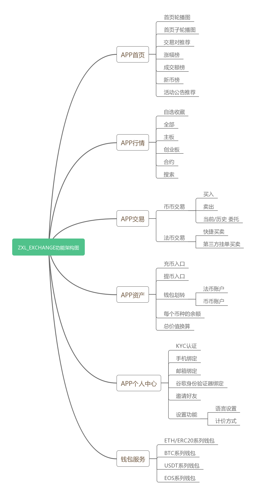

## Java公链与SpringCloud交易所项目
[](https://whoiszxl.github.io)
[](https://whoiszxl.github.io)
[](https://github.com/whoiszxl/BohemianRhapsody)
[](https://whoiszxl.github.io)


### 项目介绍
通过Java Springboot开发一个简易版公链项目，并实现钱包功能，再通过SpringCloud开发一套中心化交易所项目，考虑再用Flutter实现移动端的APP，API则通过[yapi][yapi]进行管理。

### 项目文档
文档地址： http://whoiszxl.com

### 项目架构
```
zxl_exchange_microservice
├── zxl_framework_base        -- 最基础的通用代码
├── zxl_framework_wallet_base -- 钱包的基础代码
├── zxl_service_common        -- 公用接口服务（banner等）
├── zxl_service_config        -- Spring Cloud Config
├── zxl_service_eureka        -- eureka注册中心
├── zxl_service_manager       -- 管理后台网关
├── zxl_service_market        -- 行情socket服务
├── zxl_service_sms           -- 短信服务，通过RabbitMQ调用
├── zxl_service_user          -- 用户服务
├── zxl_service_wallet        -- 钱包服务
├── zxl_service_web           -- 前台网关
├── zxl_wallet_btc            -- BTC钱包
```


### 技术选型

#### 后端技术
| 技术                 | 说明                | 官网                                                         |
| -------------------- | ------------------- | ------------------------------------------------------------ |
| Spring Boot          | 容器+MVC框架        | [https://spring.io/projects/spring-boot](https://spring.io/projects/spring-boot) |
| Spring Cloud         | 微服务框架          | [https://spring.io/projects/spring-cloud](https://spring.io/projects/spring-cloud) |
| Spring Data JPA      | ORM框架             | [https://spring.io/projects/spring-data-jpa](https://spring.io/projects/spring-data-jpa) |
| Swagger-UI           | 文档生产工具        | [https://github.com/swagger-api/swagger-ui](https://github.com/swagger-api/swagger-ui) |
| RabbitMq             | 消息队列            | [https://www.rabbitmq.com/](https://www.rabbitmq.com/)       |
| Redis                | 分布式缓存          | [https://redis.io/](https://redis.io/)                       |
| Docker               | 应用容器引擎        | [https://www.docker.com/](https://www.docker.com/)           |
| OSS                  | 对象存储            | [https://github.com/aliyun/aliyun-oss-java-sdk](https://github.com/aliyun/aliyun-oss-java-sdk) |
| JWT                  | JWT登录支持         | [https://github.com/jwtk/jjwt](https://github.com/jwtk/jjwt) |
| Lombok               | 简化对象封装工具    | [https://github.com/rzwitserloot/lombok](https://github.com/rzwitserloot/lombok) |


#### 前端技术

| 技术       | 说明                  | 官网                                                         |
| ---------- | --------------------- | ------------------------------------------------------------ |
| Vue        | 前端框架              | [https://vuejs.org/](https://vuejs.org/) |
| Flutter    | 跨平台移动UI框架       | [https://flutter.dev/](https://flutter.dev/) |
 

#### 架构图




#### 开发进度


### 开发环境

| 工具          | 版本号 | 下载                                                         |
| ------------- | ------ | ------------------------------------------------------------ |
| JDK           | 1.8    | https://www.oracle.com/technetwork/java/javase/downloads/jdk8-downloads-2133151.html |
| SpringCloud   | Finchley.M9| https://spring.io/blog/2018/03/23/spring-cloud-finchley-m9-has-been-released                                       |
| Mysql         | 5.7    | https://www.mysql.com/                                       |
| Redis         | 3.2    | https://redis.io/download                                    |
| RabbitMq      | 3.7.14 | http://www.rabbitmq.com/download.html                        |


### 项目部署

> Windows环境部署


> Linux环境部署


> Docker环境部署


## 许可证

[Apache License 2.0](https://github.com/whoiszxl/BohemianRhapsody/blob/master/LICENSE)

Copyright (c) 2018-2019 whoiszxl


[yapi]: https://github.com/YMFE/yapi
[blog]: https://whoiszxl.github.io